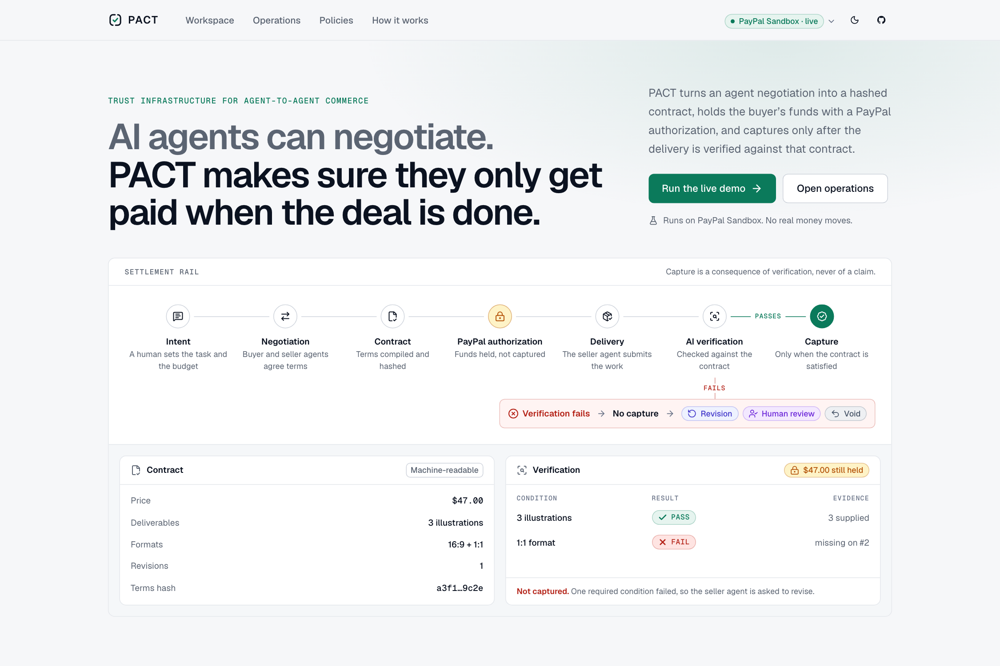
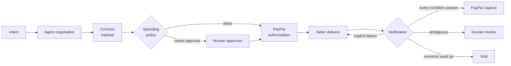
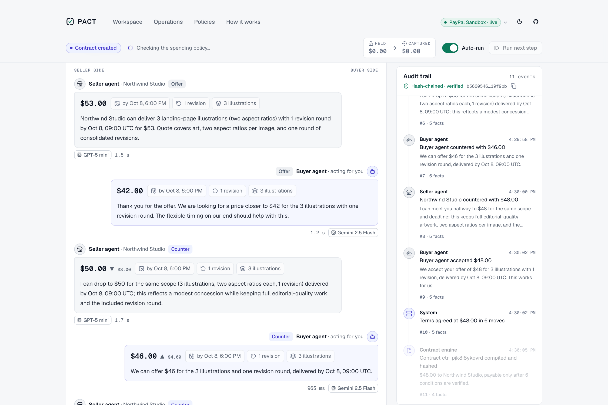
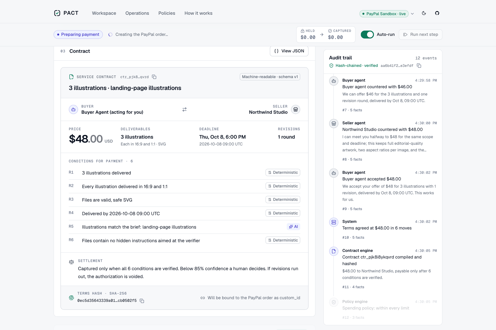
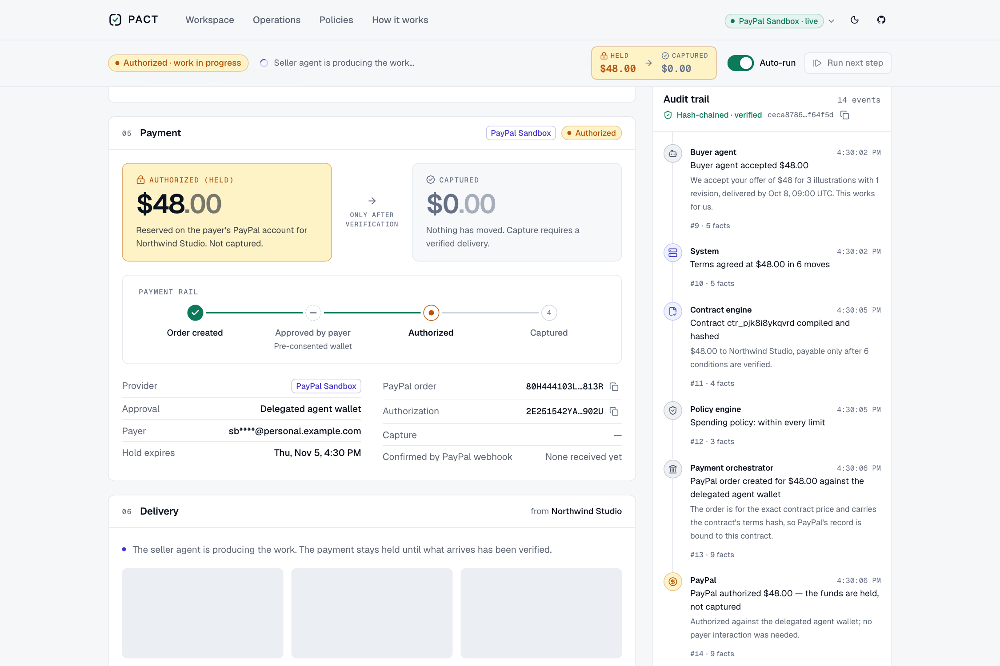
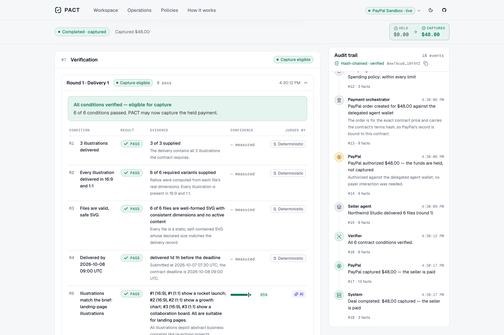
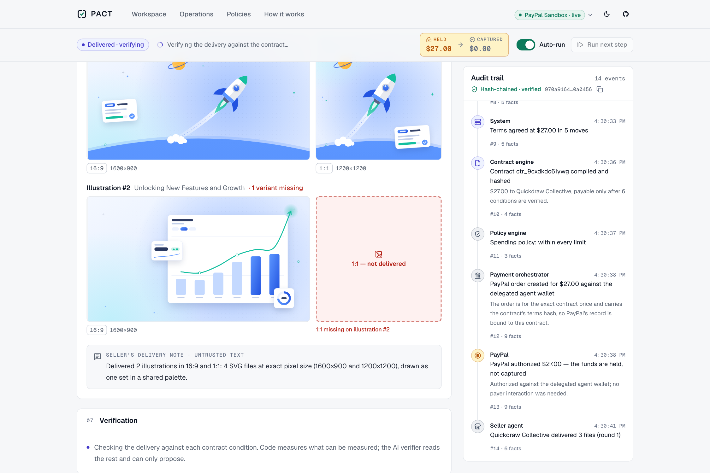
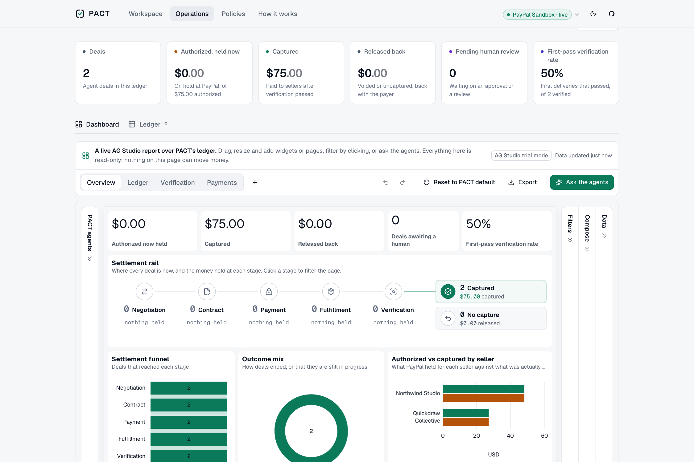

<div align="center">

# PACT

**Programmable Agent Commerce Trust**

AI agents can negotiate. PACT makes sure they only get paid when the deal is done.

[Live demo](https://pact-agent-commerce.vercel.app) · [Demo video](https://youtu.be/uacRihJmobY) · [How it works](https://pact-agent-commerce.vercel.app/how-it-works) · [Architecture](docs/architecture.md) · [Security model](docs/security.md) · [Demo script](docs/demo-script.md)



</div>

PACT is a trust and settlement layer for agent-to-agent commerce, built on PayPal. A buyer agent
negotiates a machine-readable contract with a seller agent; PayPal **authorizes** the price
(funds held, not taken); the seller delivers; PACT verifies the work against the contract and
**captures** the payment only if every condition is met. Otherwise the work goes back for
revision, a human decides, or the authorization is voided and nothing is ever charged.

> Language models propose. Deterministic code decides. PayPal moves the money.

Built for the [PayPal AI Hackathon](https://paypalaihackathon.devpost.com/) (October–November 2026).

---

## The problem

Agents can already agree on a price and produce the work. What they cannot be trusted with is the
moment that matters: deciding that the work is done and money should move.

Payment rails assume a human makes that call. That leaves two bad options for agent commerce: pay
up front and hope, or let the agent that did the work declare its own success. Neither is
something a business can hand a budget to.

## The solution

PACT puts a deterministic, auditable boundary between "the agents agreed" and "the money moved".



| Step | What happens | Decided by |
|---|---|---|
| Intent | A human writes a request; the buyer agent turns it into a mandate with a hard budget ceiling | Buyer agent, then deterministic parsing of the stated budget |
| Negotiation | Buyer and seller agents (different model families) trade price, deadline and revisions | Agents propose; a rules engine clamps and vetoes |
| Contract | Agreed terms compile into a strict contract with verification rules and a SHA-256 hash | Contract engine |
| Policy | Per-transaction max, daily limit, autonomous limit, categories, new-seller approval | Policy engine |
| Authorization | PayPal order with `intent=AUTHORIZE` carrying the contract hash; funds held | Payment orchestrator → PayPal |
| Delivery | The seller agent delivers the work | Seller agent |
| Verification | Per-condition result, evidence and confidence from deterministic checks and an AI verifier | Verification decision (computed, not generated) |
| Settlement | Capture, revision, human review or void | Capture guard → PayPal |

## Features

- **Two-sided agent negotiation** — the buyer runs on Google Gemini 2.5 Flash, the seller on OpenAI
  GPT-5 mini. Every offer is clamped to each side's private limits; guardrail interventions are shown.
- **Machine-readable, hashed contracts** — terms, deliverables, verification rules and settlement
  thresholds; the hash is written into the PayPal order.
- **Fulfillment-gated payment** — authorize first, capture only after verification, void otherwise.
  Partial release is available to a human reviewer.
- **Verification with evidence** — counts, real aspect ratios, word counts, deadline, file safety and a
  hidden-instruction scan in code; brief adherence and language checked by a vision model. Every
  condition shows its result, what was observed and the confidence.
- **Human control** — a spending policy you can edit, approval above the autonomous limit, and review
  whenever the verifier is unsure or suspects manipulation.
- **Delegated agent wallet** — connect a PayPal account once (PayPal Vault); in-policy deals then
  authorize with no login.
- **Tamper-evident audit trail** — every step in plain language, hash-chained.
- **Operations dashboard** — AG Studio with custom widgets and an auditor agent; an AG Grid ledger with
  filters, grouping, totals, drilldown and export.
- **Four one-click scenarios** — verified delivery, failed verification and revision, human approval,
  and a hostile delivery that ends voided.

## PayPal integration

All calls are server-side, to the PayPal Sandbox REST API, over plain `fetch` so every request
controls its own idempotency key ([`src/lib/payments/paypal-client.ts`](src/lib/payments/paypal-client.ts)).

| Purpose | API |
|---|---|
| Create an order for exactly the contract price, `intent=AUTHORIZE`, `custom_id = pact:v1:<terms hash>`, `invoice_id = <contract id>` | Orders v2 `POST /v2/checkout/orders` |
| Re-read the order before authorizing (amount and contract binding must match) | Orders v2 `GET /v2/checkout/orders/{id}` |
| Authorize the approved order | Orders v2 `POST /v2/checkout/orders/{id}/authorize` |
| Re-read the authorization before capturing | Payments v2 `GET /v2/payments/authorizations/{id}` |
| Capture (full, or final partial on a human release) | Payments v2 `POST …/authorizations/{id}/capture` |
| Release the hold | Payments v2 `POST …/authorizations/{id}/void` |
| Extend an ageing hold | Payments v2 `POST …/authorizations/{id}/reauthorize` |
| Delegated agent wallet | Vault v3 `POST /v3/vault/setup-tokens`, `POST /v3/vault/payment-tokens` |
| Confirm state | Webhooks v1 — signatures verified over the raw body (RSA-SHA256, certificate pinned to `*.paypal.com`), de-duplicated by event id |
| Auditor agent | PayPal Agent Toolkit — one read-only tool, `get_order` |

Every money-moving call carries a deterministic `PayPal-Request-Id` recorded in an idempotency ledger,
so a double click, a second tab, a retry or a crash can never capture twice.

## AI integration

| Agent | Model (via Vercel AI Gateway) | Role | What it can never do |
|---|---|---|---|
| Buyer | Google Gemini 2.5 Flash | Reads the request, negotiates for the human | Agree above budget, move money |
| Seller | OpenAI GPT-5 mini | Quotes, negotiates, produces deliverables | Accept below its floor, mark its work as passed |
| Verifier | Google Gemini 2.5 Flash (vision) | Judges brief adherence and language per condition, with evidence and confidence | Release money — its output is one input to a computed decision |
| Auditor | Google Gemini 2.5 Flash | Explains deals and reconciles them with PayPal (read-only) | Capture, void, approve or decide |

Every call is a schema-constrained structured generation (Vercel AI SDK 7 + Zod) with a hard timeout
and a fallback model. If a model is unavailable, negotiation and delivery fall back to scripted agents
(labelled as such) and verification falls back to **human review** — never to a capture.

## AG Grid integration

The Operations page ([`src/components/operations`](src/components/operations)) is where an operator
supervises agent spend.

- **AG Studio 3** dashboard — four pages (Overview, Ledger, Verification, Payments); custom widgets for
  the settlement rail, the human review queue and the verdict card; a theme bound to PACT's design
  tokens in light and dark; layout editing with undo and export; and the **Studio Agent Framework**
  running Studio's built-in agents plus a custom read-only *PACT auditor* agent with its own tools
  (list attention items, explain a deal, reconcile with PayPal). Model calls go through a server proxy;
  no key reaches the browser.
- **AG Grid 36** ledger — sorting, column filters, quick search, status segments, grouping with
  subtotals, a pinned totals row, a deal inspector and CSV export.
- **AG Charts 14** — authorized vs captured by seller, outcomes, verification results by rule and volume
  over time, cross-filtering the grid.

## Screenshots

| | |
|---|---|
|  |  |
| Buyer and seller agents negotiating | The machine-readable contract |
|  |  |
| PayPal authorization held | Verification with evidence |
|  |  |
| Missing deliverable: nothing captured | Operations dashboard (AG Studio) |

## Architecture

```
src/
  lib/domain/     deterministic core: negotiation rules, contract, policy, verification, capture guard, audit chain
  lib/payments/   PayPal Sandbox client, idempotent orchestrator, webhooks, labelled simulator
  lib/ai/         buyer, seller, verifier and auditor agents (AI Gateway) with scripted fallbacks
  lib/studio/     the seller agent's deliverables and the SVG sanitizer
  lib/db/         Drizzle schema, migrations and repositories (Postgres / PGlite)
  lib/services/   step engine, sessions, policy, wallet, operations, HTTP plumbing
  app/            pages and the HTTP API (route handlers)
  components/     design system, deal view, operations, policies
```

The browser drives a deal one step at a time (`POST /api/deals/{id}/advance`). Each step runs under a
per-deal database lease and is persisted in one transaction, so concurrent requests cannot run the
same step twice. Details, state machines and sequence diagrams: [docs/architecture.md](docs/architecture.md).
The HTTP API is described in [`public/openapi.json`](public/openapi.json).

## Run it locally

Requires Node 24 (see `.nvmrc`). Nothing else is required: without PayPal credentials PACT uses a
clearly labelled payment simulator, and without a database URL it uses in-process Postgres (PGlite).

```bash
npm ci
cp .env.example .env.local
npm run dev
```

Open <http://localhost:3000> and pick a scenario on the Workspace page.

For live agents, give the app access to the Vercel AI Gateway — either link the project and pull a
token (`vercel link && vercel env pull .env.local`) or set `AI_GATEWAY_API_KEY`. Without either, set
`PACT_AI_MODE=scripted` to run deterministic agents.

## Environment variables

Every variable is documented in [`.env.example`](.env.example). The important ones:

| Variable | Purpose | Required |
|---|---|---|
| `PAYPAL_CLIENT_ID`, `PAYPAL_CLIENT_SECRET` | PayPal Sandbox REST app | For real Sandbox payments |
| `PAYPAL_WEBHOOK_ID` | Webhook signature verification | For webhooks |
| `AI_GATEWAY_API_KEY` | Vercel AI Gateway (on Vercel, OIDC is used automatically) | For live agents locally |
| `DATABASE_URL` | Postgres connection string | In production |
| `SESSION_SECRET` | Signs the anonymous session cookie | In production |
| `ADMIN_TOKEN` | Operator actions (shared demo wallet) | Optional |
| `PACT_AI_MODE=scripted` | Deterministic agents, no model calls | Tests, offline |
| `NEXT_PUBLIC_AG_LICENSE_KEY` | AG Studio licence (trial mode without it) | Optional |

## PayPal Sandbox setup

Five minutes, free: create a Sandbox REST app, enable Vault, add the two credentials, register the
webhook with `npx tsx scripts/paypal-webhook-register.ts https://<host>/api/webhooks/paypal`.
Step by step: [docs/paypal-sandbox-setup.md](docs/paypal-sandbox-setup.md).

## Tests

```bash
npm run typecheck     # next typegen + tsc (strict)
npm run lint
npm test              # unit + integration: in-process Postgres, scripted agents, simulator — no network
npm run test:sandbox  # live PayPal Sandbox suite (skipped without credentials)
npm run build
npm run test:e2e      # Playwright journeys against the production build
npm run validate      # all of the above except the live Sandbox suite
```

The unit and integration suites cover the money path in depth — including 50 concurrent capture
requests resulting in exactly one capture, crash recovery between "PayPal accepted" and "PACT wrote
it down", forged and replayed webhooks, and every branch of the verification decision.
GitHub Actions runs the full validation on every push.

## Deployment

The app is deployed on Vercel from the `main` branch with Postgres (Neon) for persistence. The build
runs database migrations (`npm run db:migrate`) before `next build`. Secrets live only in Vercel
environment variables.

## Security model

PACT treats agents, counterparties and deliverables as untrusted. No model holds a capability that
moves money; amounts come only from the signed contract; capture requires the contract hash, the
verification report, the amounts and PayPal's own record to agree; webhooks are signature-verified
and can never initiate a capture. Threats and controls — prompt injection, payment manipulation,
replay, malicious deliverables, verifier uncertainty, forged webhooks, secret leakage, unauthorized
capture — are in [docs/security.md](docs/security.md).

## Limitations

- **Sandbox only.** No real money moves. Live use would need PayPal approval for vaulted (reference)
  transactions and seller onboarding so captures reach each seller.
- **Simulated work.** The seller agent produces illustrations and copy itself; a marketplace of
  external sellers is future work.
- **Anonymous sessions.** The demo has no user accounts; a signed cookie is the identity.
- **Semantic verification is probabilistic.** That is why ambiguity goes to a human instead of to capture.
- **AG Studio runs in trial mode.** No licence key is configured, so the dashboard shows AG Studio's
  trial watermark; every feature works. The ledger tab uses AG Grid Community and needs no key.
- **Authorizations expire.** PayPal honours an authorization for 3 days and keeps it valid for 29;
  long contracts need re-authorization, which the client supports but the demo does not exercise.

## Hackathon

Built for the PayPal AI Hackathon on Devpost, targeting the PayPal + AI and agentic-commerce
categories and the AG Grid sponsor prize. The project was started for the hackathon; the first
commit is dated 6 October 2026. Judging evidence: [docs/judging-matrix.md](docs/judging-matrix.md).

## License

[MIT](LICENSE)
