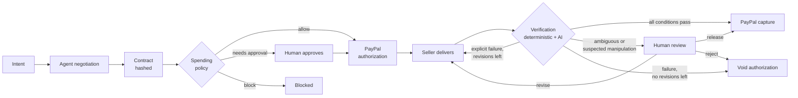
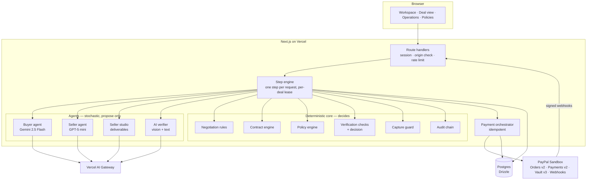
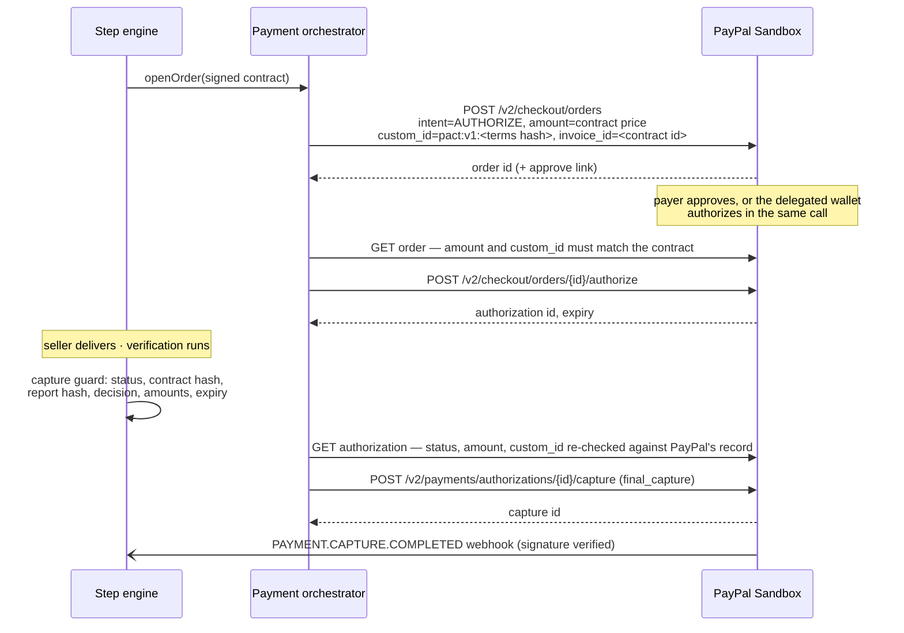
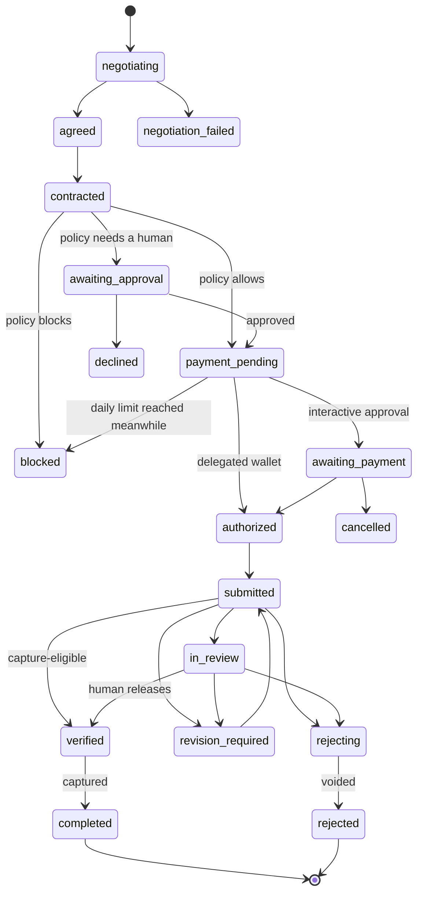

# PACT architecture

PACT (Programmable Agent Commerce Trust) is a trust and settlement layer for agent-to-agent
commerce. Agents negotiate; PACT decides — deterministically and auditably — whether the
negotiated work has earned its payment, and only then captures it through PayPal.

The design rule that shapes everything else:

> **Language models propose. Deterministic code decides. PayPal moves the money.**

No model output can change a deal's status, a spending limit, or a payment. Every model output
is parsed against a strict schema and then passed through an engine that can clamp it, veto it,
or escalate to a human.

## Lifecycle

Funds are **authorized** (held on the payer's PayPal account) before any work starts and are
**captured** only after verification. If the contract is not met, the authorization is voided and
nothing is ever captured. PACT uses PayPal authorization and capture; it is not an escrow service
and never takes custody of funds.

## Components

| Component | Location | Responsibility |
|---|---|---|
| Buyer agent | `src/lib/ai/intent.ts`, `negotiators.ts` | Turns the human's request into a mandate (budget ceiling, deadline, scope) and negotiates within it |
| Seller agent | `src/lib/ai/negotiators.ts`, `src/lib/studio/` | Quotes from a private rate card, negotiates above its floor, produces the deliverables |
| Negotiation rules | `src/lib/domain/negotiation.ts` | Turn order, move limit, clamps and vetoes (buyer can never agree above budget; seller never below floor) |
| Contract engine | `src/lib/domain/contract.ts` | Compiles agreed terms into a strict, hashed, machine-readable contract and derives its verification rules |
| Policy engine | `src/lib/domain/policy.ts` | Per-transaction maximum, autonomous limit, daily limit, allowed categories, new-seller approval |
| Payment orchestrator | `src/lib/payments/orchestrator.ts` | The only code that moves money at PayPal: create order (intent `AUTHORIZE`), authorize, capture, void |
| PayPal client | `src/lib/payments/paypal-client.ts` | Raw REST with OAuth, `PayPal-Request-Id` idempotency, `debug_id` capture, safe retries, webhook signature verification |
| Verifier | `src/lib/domain/verification.ts`, `src/lib/ai/verifier.ts` | Deterministic checks (counts, real aspect ratios, word counts, deadline, format, hidden-instruction scan) plus AI-judged rules, each with result, evidence and confidence |
| Capture guard | `src/lib/domain/settlement.ts` | The last check before money moves: status, contract hash, report, amounts, expiry, human release |
| Audit chain | `src/lib/domain/audit.ts` | Append-only, hash-chained event log in plain language |
| Step engine | `src/lib/services/deals.ts` | Executes one lifecycle step per request under a per-deal lease; the only writer of deal status |
| Auditor agent | `src/lib/ai/auditor.ts`, `src/lib/services/auditor.ts` | Re-reads PayPal's record through the PayPal Agent Toolkit (`get_order`, read-only) and reconciles it with PACT's ledger, field by field |
| Operations read model | `src/lib/services/operations.ts` | One row per deal, payment event and verification check for the operations dashboard |

## The contract is bound to the payment

The contract is compiled deterministically from the agreed terms and hashed
(`SHA-256` over canonical JSON). That hash travels with the money:

Capture is refused when the verification report was produced for a different contract hash, when
PayPal's own record of the order does not carry this contract's hash, or when any amount differs.

## Deal state machine

The deal lifecycle is a closed, table-driven state machine (`src/lib/domain/status.ts`).
A transition that is not in the table cannot happen.

Two more terminal states are reachable from wherever funds are (or are about to be) held, and are
left out of the diagram for legibility: `expired` — PayPal released or expired the authorization
before settlement — and `failed` — PayPal refused an operation for good. `src/lib/domain/status.ts`
is the authoritative table.

Payments have their own machine: `none → created → approved → authorized → captured | voided | expired | failed`.

## How a step executes

The browser drives progress by calling `POST /api/deals/{id}/advance`. Each call executes **at most
one** step:

1. Check the session owns the deal.
2. Take a per-deal lease in the database. If another request holds it, return `busy` — a double
   click, a second tab or a refresh can never run the same step twice.
3. Do the external work for this step (a model call or a PayPal call).
4. Persist the result, the audit events and the status change in one transaction.

The order step does one thing more before it calls PayPal: under a per-owner lock it re-checks the
daily limit against everything already committed today and records the payment as a reservation,
so two deals running at once cannot both squeeze under the limit.

Every money-moving PayPal call (create order, authorize, capture, void) carries a deterministic
`PayPal-Request-Id` and is recorded in an idempotency ledger (`payment_operations`). If the process
dies after PayPal accepted a capture but before PACT wrote it down, the next attempt replays the
same key and adopts the existing capture instead of creating a second one.

## Verification

A verification report contains one check per contract rule:

| Field | Meaning |
|---|---|
| condition | The rule in plain language, e.g. "Every illustration delivered in 16:9 and 1:1" |
| result | `pass`, `fail` or `uncertain` |
| evidence | What was observed, e.g. "1:1 missing on illustration #2" |
| confidence | 0–1; deterministic checks are 1.0 |
| evaluator | `deterministic` or `ai` |

The decision is computed, not generated:

| Situation | Decision | Money |
|---|---|---|
| Every required rule passes with confidence at or above the auto-capture threshold | capture-eligible | Captured |
| A required rule explicitly fails and a revision remains | revision required | Stays authorized, not captured |
| A required rule explicitly fails and no revision remains | reject | Authorization voided |
| Anything ambiguous, low confidence, AI unavailable, or suspected manipulation | human review | Stays authorized until a human decides |

A model outage can never release funds: unanswered AI rules become `uncertain`, which routes to a human.

## Delegated agent wallet

A human can connect a PayPal account once (PayPal Vault setup token → payment token). After that
the buyer agent can authorize **in-policy** deals without a PayPal login; anything above the
autonomous limit still pauses for approval inside PACT. PayPal vault tokens carry no spending cap
of their own — the cap is PACT's policy engine, which is deterministic and sits outside the model.

Without a connected wallet, the payer approves each order in PayPal (redirect flow).

## Persistence

PostgreSQL through Drizzle. The same schema and SQL migrations (`drizzle/`) run on managed Postgres
in production and on PGlite (in-process Postgres) for local development and CI, so the test suite
needs no external services.

| Table | Holds |
|---|---|
| `deals` | Aggregate root: status, mandate, agreed terms, policy evaluation, lease |
| `negotiation_moves` | Every validated move with guardrail notes and the model that produced it |
| `contracts` | The signed contract document and its terms hash |
| `payments` | PayPal order, authorization and capture ids; authorized and captured amounts |
| `payment_operations` | Idempotency ledger, keyed by the `PayPal-Request-Id` |
| `submissions`, `verification_reports` | Deliveries and per-rule verification evidence |
| `audit_events` | Hash-chained audit trail |
| `policies`, `wallets` | Spending policy and delegated wallet per session |
| `webhook_events` | Verified PayPal webhooks, deduplicated on event id |
| `rate_limits` | Fixed-window counters that protect the public demo |
| `simulated_orders` | State of the payment simulator (keyless development and CI only) |

## Degraded modes

| Failure | Behaviour |
|---|---|
| Model slow or unavailable during negotiation or delivery | Hard timeout, gateway fallback to a second model, then a scripted agent. The deal is labelled as degraded. |
| Model unavailable during verification | AI rules become `uncertain` → human review. Never auto-capture. |
| PayPal 5xx / timeout | Retried with the same idempotency key; the step stays where it is and can be retried, up to four attempts per operation. After that an order or void ends the deal as failed; a capture whose outcome is unknown is only written off if the hold can be voided, so a deal is never marked failed while its payment went through. |
| No PayPal credentials (keyless local dev, CI) | A simulator stands in for PayPal and every payment is labelled "simulated". |
